# Getting Started

## Quick Start
To start the backend,
```
gradlew bootrun
```

### Setup
This project uses keycloak for authentication. To set up keycloak, run
```declarative
docker compose up -d
```
Keycloak will be available at http://localhost:8080. Setup guide for keycloak is in [Keycloak Setup](#keycloak-setup).

### DevContainers
If you're lazy to install Java, you may run the project in VS Code using DevContainers extention with the given `Dockerfile`.


## Testing endpoints
### Streaming JSON response via HTTP GET calls
You may call the sample `/notifications` endpoint by,
```
curl --location 'http://localhost:8081/notifications' \
--header 'Content-Type: application/stream+json'
```

### RSocket
1. Download `rsc` from https://github.com/making/rsc.
2. RSocket endpoints requires authencation. Get the bearer token using the following curl command, updating `KEYCLOAK_URL`, `REALM_NAME`, `CLIENT_ID`, `USERNAME` and `PASSWORD` as required.
   ```
   export KEYCLOAK_URL=http://localhost:8080
   export REALM_NAME=my-realm
   export CLIENT_ID=my-sample-app
   export USERNAME=<your username>
   export PASSWORD=<your password>
   
   ACCESS_TOKEN=$(curl -s --location "$KEYCLOAK_URL/realms/$REALM_NAME/protocol/openid-connect/token" \
   --header "Content-Type: application/x-www-form-urlencoded" \
   --data-urlencode "grant_type=password" \
   --data-urlencode "client_id=$CLIENT_ID" \
   --data-urlencode "username=$USERNAME" \
   --data-urlencode "password=$PASSWORD" \
    | grep -o '"access_token":"[^"]*"' | cut -d':' -f2 | tr -d '"' ) && echo $ACCESS_TOKEN
   ``` 
3. Test the respective rSocket endpoints:
    ```
    // Request-response
   rsc --request --route=/request-response --authBearer=$ACCESS_TOKEN --data="my sample input" tcp://localhost:7000
   
   // Fire-forget
   rsc --request --route=/fire-forget --authBearer=$ACCESS_TOKEN --data="my sample input" tcp://localhost:7000 
       
    // Request-stream
   rsc --stream --route=/request-stream --authBearer=$ACCESS_TOKEN --data="my sample input"  tcp://localhost:7000
   
   // Request-stream (requires 'administrator' client role)
   rsc --stream --route=/admin.request-stream --authBearer=$ACCESS_TOKEN --data="my sample input"  tcp://localhost:7000

   // Request-stream (requires 'user' client role)
   rsc --stream --route=/normal.request-stream --authBearer=$ACCESS_TOKEN --data="my sample input"  tcp://localhost:7000
   
   
      rsc --stream --route=/admin.request-stream --authBearer=%TOKEN% --data="my sample input"  tcp://localhost:7000
    ```
   You should get 'Access Denied' response if `--authBearer=$ACCESS_TOKEN` is not provided.
   
## Keycloak Setup

1. Login to keycloak at http://localhost:8080 with the credentials defined in the docker compose file.
2. Create a new realm `my-realm`.
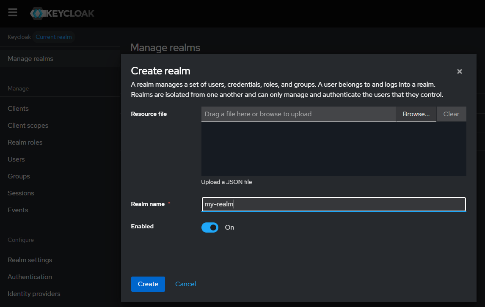
3. Navigate to `Clients` and create a new client `my-sample-app` with the following settings. Leave the other default settings.
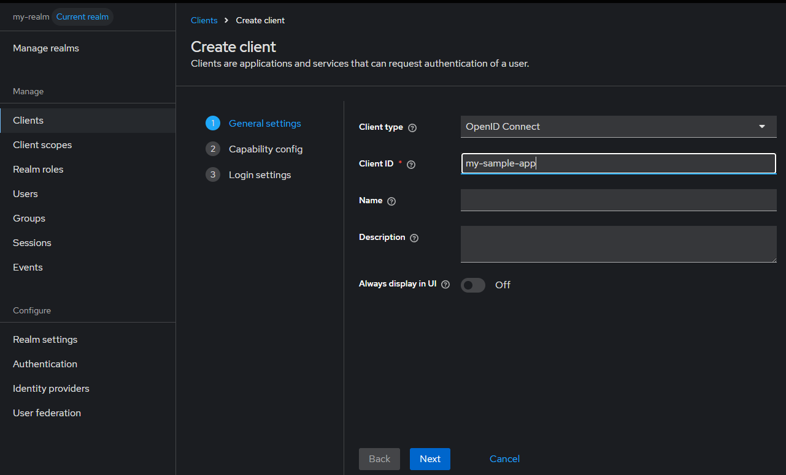
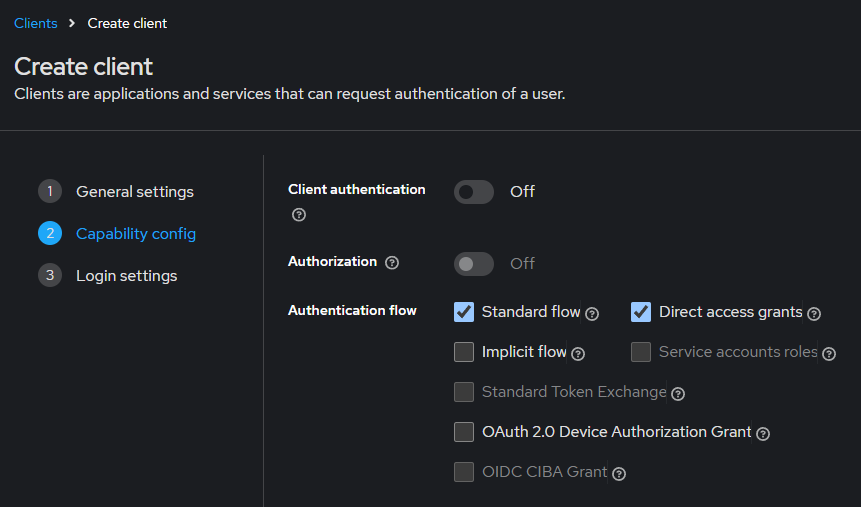
4. Navigate to `my-sample-app` client and add two new client roles (`administrator` and `user`):
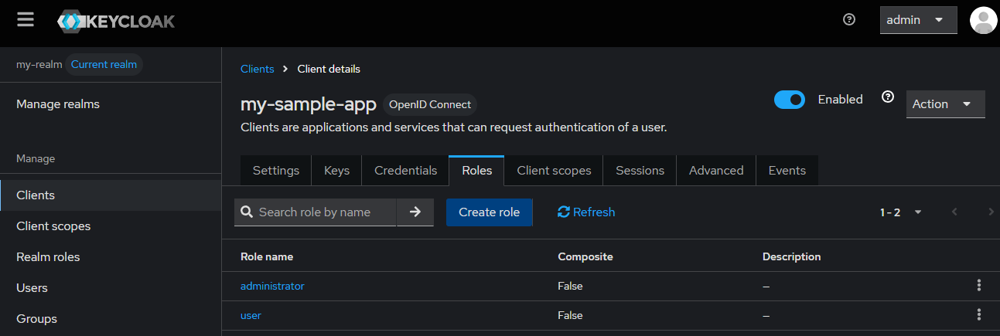
5. Navigate to `Users` and create two new users (`adminuser` and `normaluser`). Click on each user and set password their password. Ensure the password is not temporary.
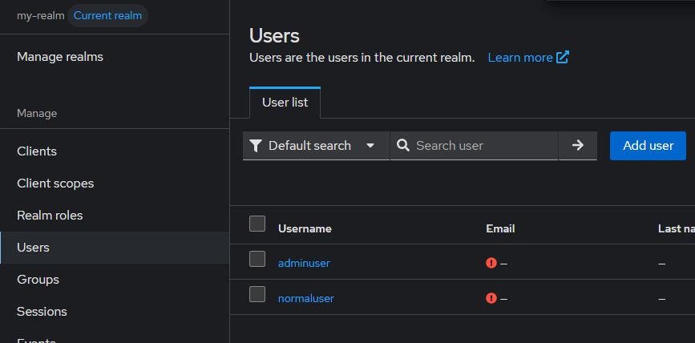
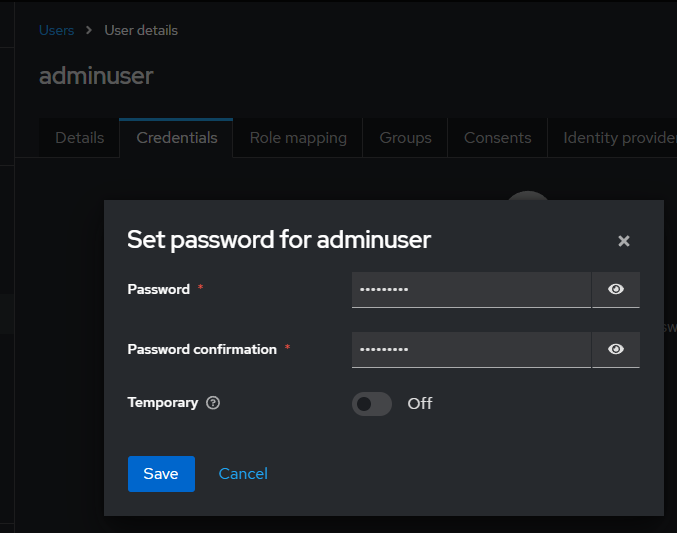
6. Navigate to `Groups` and create two new groups (`admingroup` and `normalgroup`).
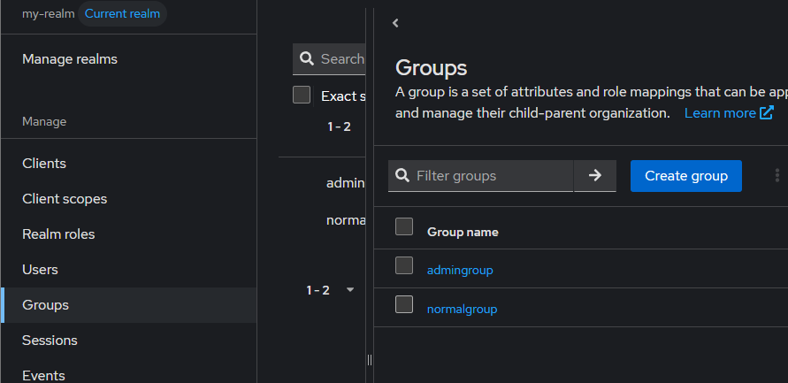
   1. Add the respective client roles created in step 4 to the respective groups (i.e. `administrator` is added to `admingroup`, `user` is added to `normalgroup`).
      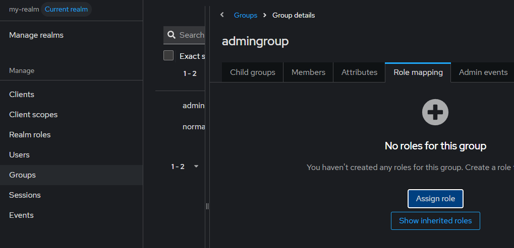
      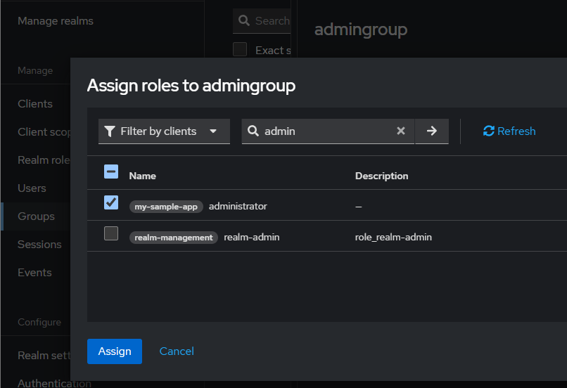
      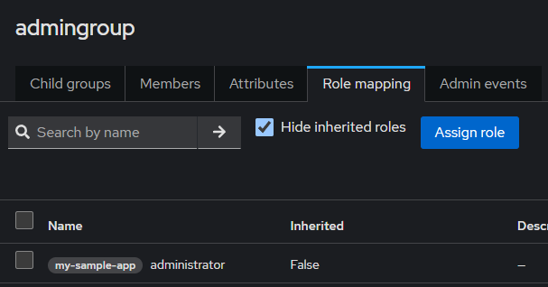
   2. Add the respective users created in step 5 to the respective groups (i.e. `adminuser` to `admingroup` and `normaluser` to `normalgroup`).
      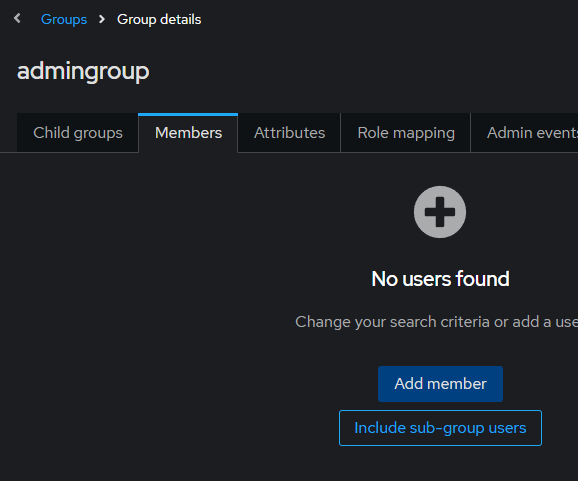
      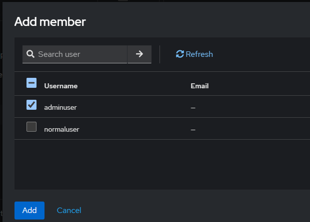
      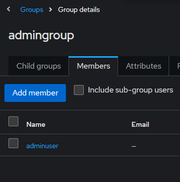
7. (Optional) If you followed step 5 to create users, ensure that the `Required actions` for the `Authentication` tab is as follows. If not, keyclaok will complain that the user setup is incomplete when retrieving the access token to test the endpoints.
   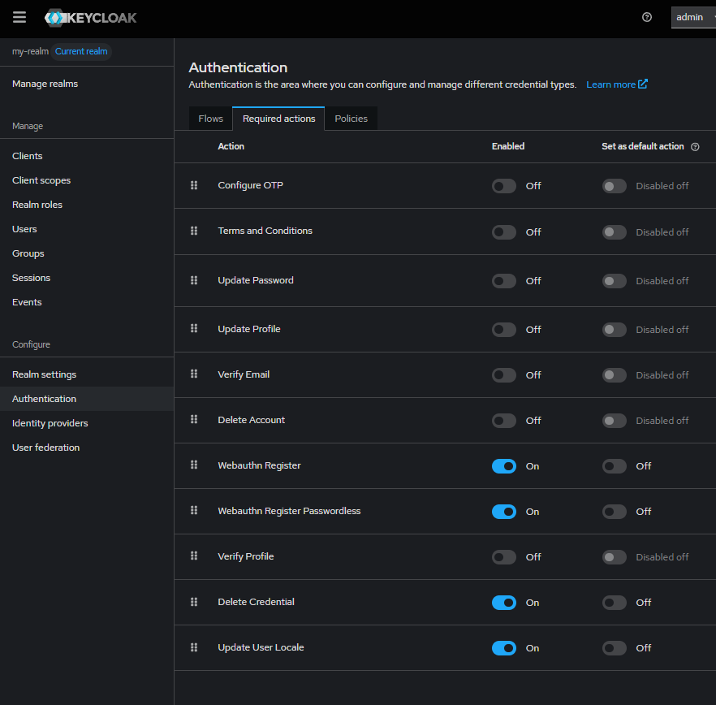
8. To check that the users have been configured properly with the relevant client roles,
   1. generate a token at http://localhost:8080/realms/my-realm/protocol/openid-connect/token. 
      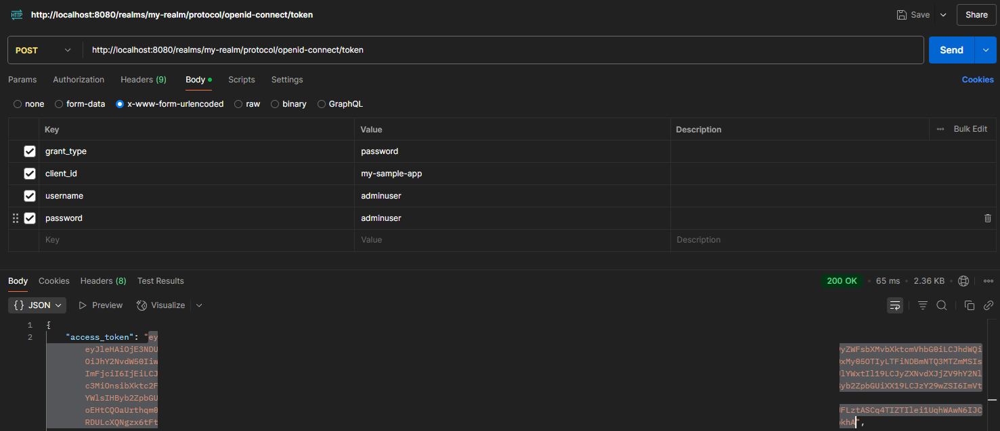
   2. Decode the generated jwt and ensure that the `resource_access` section has the correct client roles configured (sample output using https://jwt.io/).
      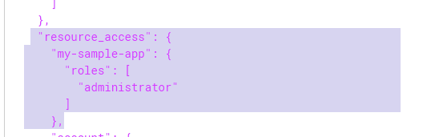

